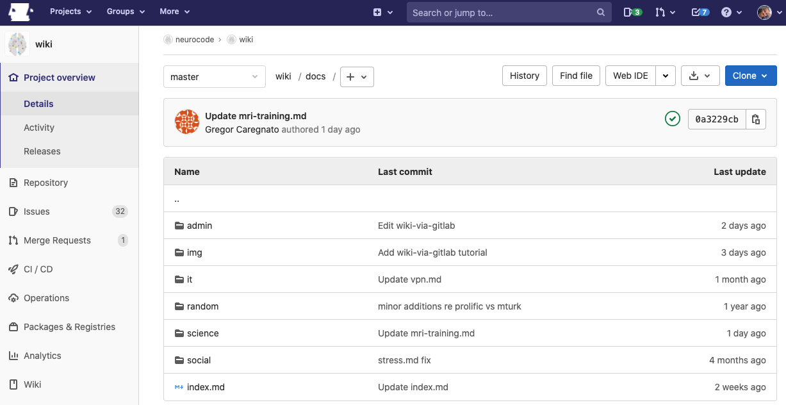
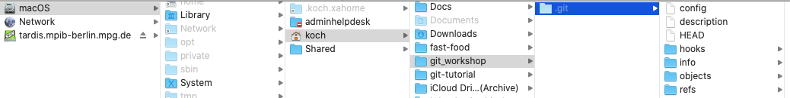
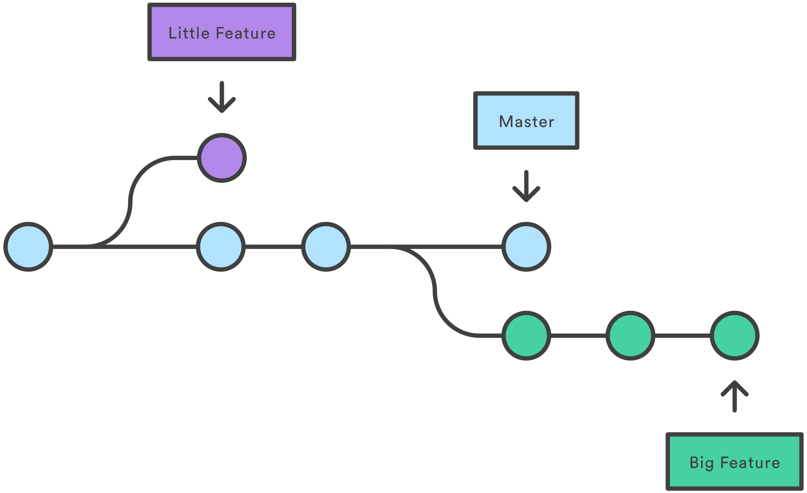
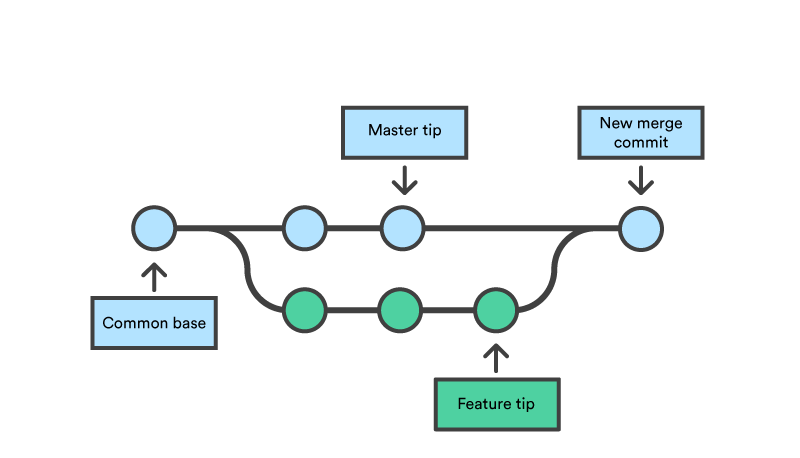
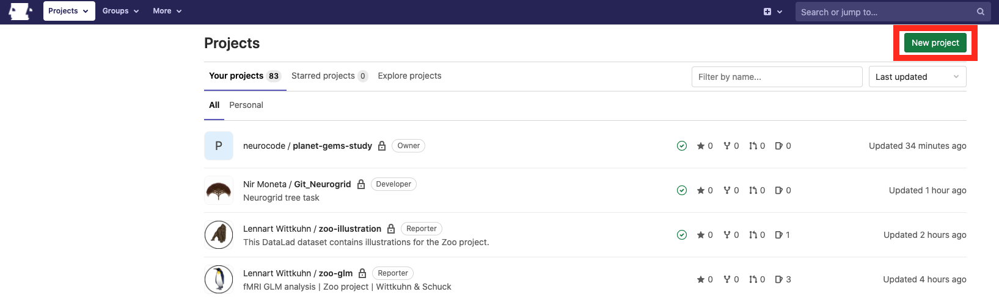
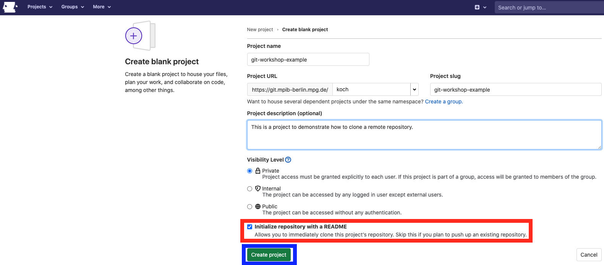
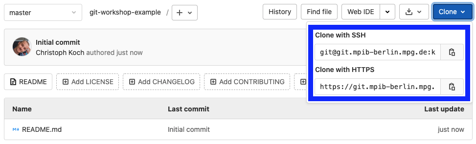
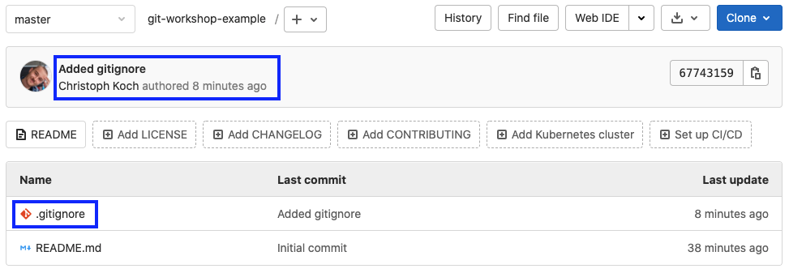

class: middle


## Introduction to `git`

---
class: center, middle

#### This is classic Linus Torvalds


---
class: center, middle

#### This is recent Linus Torvalds


---
class: center, middle

#### This is artwork of Linus Torvalds


---
class: center, middle

#### This is also Linus Torvalds (but let's not talk about it)


---

.center[
#### The Story of `git`
]

.pull-left[
.center[
>**I'm an egoistical bastard, and I name all my projects after myself. First "Linux", now "`git`"**

vs.

> **`git` can mean anything, depending on your mood**
]
]

--

.pull-right[
- **Back in the day:** Software developers used **BitKeeper** to collaborate on code with colleagues

- Free access to BitKeeper was revoked after a company broke down in 2005

- A new solution was needed so **Linus Torvalds** coded it up

- First version after a couple of days
]


---

#### `git` is a DVCS

```bash
tig
```

```bash
2021-04-15 17:57 +0200 Koch           o [master] {origin/master} {origin/HEAD} p
2021-04-12 18:01 +0200 Koch           o work in progress/testset_buffer
2021-04-12 12:07 +0200 Koch           o [rework/no_buffer_testing_set] {origin/r
2021-04-08 17:27 +0200 Koch           o Updated RawClassification function
2021-04-08 14:56 +0200 Koch           o Before rework: no buffer in testing set
2021-03-16 13:22 +0100 Koch           o Add exclude function
2021-02-24 18:08 +0100 Koch           o Finished excluding pipeline
2021-02-17 17:59 +0100 Koch           o Add correction of pulse flucs
```

.center[Distributed Version Control System]

--

- Program that keeps track of a folder structure
- A folder structure that `git` keeps track of is called a **"repository"**

---

#### `git` is a DVCS

```bash
tig
```

```bash
2021-04-15 17:57 +0200 Koch           o [master] {origin/master} {origin/HEAD} p
2021-04-12 18:01 +0200 Koch           o work in progress/testset_buffer
2021-04-12 12:07 +0200 Koch           o [rework/no_buffer_testing_set] {origin/r
2021-04-08 17:27 +0200 Koch           o Updated RawClassification function
2021-04-08 14:56 +0200 Koch           o Before rework: no buffer in testing set
2021-03-16 13:22 +0100 Koch           o Add exclude function
2021-02-24 18:08 +0100 Koch           o Finished excluding pipeline
2021-02-17 17:59 +0100 Koch           o Add correction of pulse flucs
```

.center[Distributed **Version Control** System]
- Taking **snapshots** of your repository at any point in time
- Go back to any snapshot and its current state of the project
- All changes to files (and authors) are stored in a history

---

#### `git` is a DVCS

```bash
tig
```

```bash
2021-04-15 17:57 +0200 Koch           o [master] {origin/master} {origin/HEAD} p
2021-04-12 18:01 +0200 Koch           o work in progress/testset_buffer
2021-04-12 12:07 +0200 Koch           o [rework/no_buffer_testing_set] {origin/r
2021-04-08 17:27 +0200 Koch           o Updated RawClassification function
2021-04-08 14:56 +0200 Koch           o Before rework: no buffer in testing set
2021-03-16 13:22 +0100 Koch           o Add exclude function
2021-02-24 18:08 +0100 Koch           o Finished excluding pipeline
2021-02-17 17:59 +0100 Koch           o Add correction of pulse flucs
```

- Can work as a **time machine**
  - Restore projects at specific snapshots
  - Compare different snapshots
  
> *Oh no, my decoding results completely changed compared to last time I checked!*
> 
> *What did I change since then?*

---

#### The power of the `remote`

.center[**Distributed** Version Control System]

.pull-left[
.center[

]

.center[


]
]

.pull-right[
.center[
Instead of on your `local` machine these repositories can also be set up on a **`remote`** location!
]
- GitLab, GitHub, BitBucket, ...
- This is accessible to everybody you invite

***

.center[**The Pros:**]
- Backup save form all harm
- **Collaboration**
     - Others can read/copy/edit your code
     - Suggest changes
     - Fix problems
- Sharing
     - Make code for your analysis available for everyone
     - Yay! Open Science!
]

---
class: middle

.center[

]

---

#### Today we will...

- ...give an overview of the **basics commands**

```bash
git status
git add
git commit
git checkout
git merge
git clone
git push
git pull
```

--

- ...introduce a **workflow guideline** to avoid problems
     - Using branches and merging

--

- ...learn about **collaborative work** using GitLab
    - in lab use-case example
    - Dealing with merge conflicts
    - Git issues

--

- ...cover **project management** using GitLab

--

- ...end with some **advanced usage** of `git`

---
class: center, middle

### Let's `git` going

---
class: middle

## `git`: The basics 

---

### Interacting with `git`

`git` can be interacted with in different ways:

.left-column[
1. Command line

2. GUI
]

---

### Interacting with `git`

`git` can be interacted with in different ways:

.left-column[
1. **Command line**

2. GUI
]

.right-column[

- Open your terminal

```bash
git
```

```bash
usage: git [--version] [--help] [-C <path>] [-c <name>=<value>]
           [--exec-path[=<path>]] [--html-path] [--man-path] [--info-path]
           [-p | --paginate | -P | --no-pager] [--no-replace-objects] [--bare]
           [--git-dir=<path>] [--work-tree=<path>] [--namespace=<name>]
           <command> [<args>]
```

- Most basic way to work with `git`
     - No additional program required
- Best way to teach `git`
     - the same for everyone
     - knowing what's actually going on

]

---

### Interacting with `git`

`git` can be interacted with in different ways:

.left-column[
1. Command line

2. **GUI**
]

.right-column[
.center[

]

- Applications providing a visual interface
- Some in the **Managed Software Center**

]

---

### Creating a `git` repository

> Program that keeps track of a folder structure

***

**Let's tell git to do exactly that!**

- Create new `git_workshop` folder in our home directory
- Tell `git` to keep track of it

```bash
cd ~
mkdir git_workshop
cd git_workshop
*git init
```

```bash
Initialized empty Git repository in /Users/koch/git_workshop/.git/
```

.center[

]

---

### `git` keeping track

**Let's create a file and see if `git` really notices**

```bash
touch README.md
```

--

We can regularly check what `git` thinks by using the `git status` command

```bash
git status
```

```bash
On branch master

No commits yet

Untracked files:
  (use "git add <file>..." to include in what will be committed)
*	README.md

nothing added to commit but untracked files present (use "git add" to track)
```

It lists our newly created file `README.md` as an **untracked file**!

---

### `git` keeping track

- `git` **does not blindly just keep track** of everything in the folder
- Helpful because it prevents us from tracking files that are...
     - ...too large
     - ...not interesting

***

--

**How do I tell `git` to keep track of a file?**
- Use the `git add` command to add the file to be tracked
- Check if `git` now keeps track with the `git status` command

```bash
git add README.md
git status
```

```bash
On branch master

No commits yet

Changes to be committed:
  (use "git rm --cached <file>..." to unstage)
*	new file:   README.md
```

---

### Staging and commiting

.left-column[
.center[
.pull-left[
Untracked

|

Staged

|

Committed
]
]
]

.right-column[

]

---

### Staging and commiting

.left-column[
.center[
.pull-left[
**Untracked**

|

Staged

|

Committed
]
]
]

.right-column[
Files that were changed but have not yet been added

.center[

]
]

---

### Staging and commiting

.left-column[
.center[
.pull-left[
Untracked

**|**

Staged

|

Committed
]
]
]

.right-column[
**From untracked to staged:**

```bash
git add <YOUR FILE>
```

```bash
git add -A
```

```bash
git add .
```
]

---

### Staging and commiting

.left-column[
.center[
.pull-left[
Untracked

|

**Staged**

|

Committed
]
]
]

.right-column[

"Preperation layer"

Files that will be tracked as soon as we "commit" to it


.center[

]

]

---

### Staging and commiting

.left-column[
.center[
.pull-left[
Untracked

|

Staged

**|**

Committed
]
]
]

.right-column[

**From staged to committed:**

```bash
git commit
```

```bash
git commit -m 'My commit message'
```

- This will commit to all prepared changes/things to keep track of
- It also adds a tiny message (written by you) what was done

]

---

### Staging and commiting

.left-column[
.center[
.pull-left[
Untracked

|

Staged

|

**Committed**
]
]
]

.right-column[


```bash
git commit -m 'Added README.md'
```

```bash
[master (root-commit) 214c62b] Added README.md
 1 file changed, 0 insertions(+), 0 deletions(-)
 create mode 100644 README.md
```

.center[

]
]

---

### Staging and commiting

.left-column[
.center[
.pull-left[
Untracked

|

Staged

|

**Committed**
]
]
]

.right-column[


```bash
git commit -m 'Added README.md'
```

```bash
[master (root-commit) 214c62b] Added README.md
 1 file changed, 0 insertions(+), 0 deletions(-)
 create mode 100644 README.md
```

***

**Congrats!**

You created your first commit!

Everything that was done is now archived and you will always be able to go back in time!

]

---

### Let's do it again!

**Add some lines to the `README.md`**

```bash
echo 'My first git project!' >> README.md
```

**Check what changed in comparison to our most recent commit**

```bash
git diff README.md
```

```bash
diff --git a/README.md b/README.md
index e69de29..eb43af5 100644
--- a/README.md
+++ b/README.md
@@ -0,0 +1 @@
*+My first git project!
```


---

**Are the changes we made about to be commited?**

```bash
git status
```

```bash
On branch master
*Changes not staged for commit:
  (use "git add <file>..." to update what will be committed)
  (use "git restore <file>..." to discard changes in working directory)
	modified:   README.md
```

--

**No! Let's stage our changes...**

```bash
git add -A
git status
```

```bash
On branch master
*Changes to be committed:
  (use "git restore --staged <file>..." to unstage)
	modified:   README.md
```

---

**...commit them...**

```bash
git commit -m 'Changes to README'
```

```bash
[master ffaf3f8] Changes to README
 1 file changed, 1 insertion(+)
```

--

**...and look at our history**

```bash
git log
```

```bash
commit ffaf3f8914bea3a08f3ee5dad2c939c9556b20cd (HEAD -> master)
Author: Christoph Koch <koch@mpib-berlin.mpg.de>
Date:   Fri Apr 16 19:19:25 2021 +0200

    Changes to README

commit 214c62bb7252d0bb7c995a590667e4b429ed3d40
Author: Christoph Koch <koch@mpib-berlin.mpg.de>
Date:   Fri Apr 16 18:56:47 2021 +0200

    Added README.md
```

---

**...commit them...**

```bash
git commit -m 'Changes to README'
```

```bash
[master ffaf3f8] Changes to README
 1 file changed, 1 insertion(+)
```

**...and look at our history**

```bash
tig
```

```bash
2021-04-16 19:19 +0200 Christoph Koch o [master] Changes to README
2021-04-16 18:56 +0200 Christoph Koch I Added README.md
```

---

***

.center[
**This covers the most basic commands to keep track of the files of a project!**
]

***

However, there are still some things to understand to use `git` the way it is intended to be used:

- **Avoid files from being tracked** that you don't care about
     - The `.gitignore` file
     
- Keep your main project safe while still **trying out new things** (that might produce errors)
```bash
git branch
git checkout
```

- Interact with the **`remote`** (e.g. GitLab)
```bash
git push
git pull
```

---
class: middle

## `git`: The not-so-much basics

---

### The `.gitignore`

Some files in our folder structure are annoying to track:
- **Very large files:** Commands take super long (`git add`, `git commit`, `git status`, ...)
- Files that can't be changed without changing the complete file (e.g. `.pdf`, images, ...)
- **`.DS_Store`**: God damn you, `.DS_Store`!

Luckily, `git` can read a text file in which you can collect all of the stuff **you don't want to track**, but still **don't want to delete**!

***

Let's create a `.gitignore` and fill it with a few things to ignore

```
touch .gitignore
echo "*.pdf" >> .gitignore
echo "*DS_Store" >> .gitignore
```

.center[
**Let's see if it works!**
]


---

**Create an undesired file:**

```
touch .DS_Store
```

***

**Check if `git` lists the new file**

```
git status
```

```
On branch master
Untracked files:
  (use "git add <file>..." to include in what will be committed)
	.gitignore

nothing added to commit but untracked files present (use "git add" to track)
```

Note how the `.DS_Store` file we created **does not show up as an untracked file** since it is ignored by **being listed in the `.gitignore`**!

***

**Let's not forget about commiting your changes, though!**

```
git add -A
gti commit -m 'Added .gitignore'
```

---
class: middle

**An example for a `.gitignore`**

```
 # Exclude MacOS junk
 .DS_Store
 ._.DS_Store

 # Exclude temporary files
 *._*
 *._anon*

 # Exclude .html files
 *.html

 # Exclude data directories from tracking
 bids/
 sourcedata/
```

-  use a `*` as wildcard (placeholder for any text)
- `bids/` will ignore the complete directory called `bids`

---

### Branching

Sometimes you are about to introduce some big changes which might cause some problems!

Best to keep a version around that is untouched!

.center[

]

---

**Let's create a branch and switch to it:**

```
git branch test_branch
git checkout test_branch
```

or

```
git checkout -b test_branch
```

***

--

**Does `git` tell us on which branch we are?**

```
git status
```

```
*On branch test_branch
nothing to commit, working tree clean
```

***

While we are on this branch, we can do whatever we want! **The `main` branch** (which we were on previously) **will remain unchanged!**

---

**Let's work a little while we are on this branch:**

Add some lines to our `README.md`:

```
echo '# Git workshop' >> README.md
echo 'This is an example repository.' >> README.md
```

***

Check what changes we introduced:

```
git status
```

```
On branch test_branch
Changes not staged for commit:
  (use "git add <file>..." to update what will be committed)
  (use "git restore <file>..." to discard changes in working directory)
	modified:   README.md
```

***

And stage and commit our changes:

```
git add -A
git commit -m 'Edit README.md'
```

---

### Merging

If our big changes are all okay and don't produce problems we might want to **keep them around in our main project!**

This is done by switching to the branch that should adopt the changes and using **`git merge`**

***

**Switch to the master branch:**

```
git checkout master
```

```
Switched to branch 'master'
```

***

**And introduce the changes of our `test_branch` into the `master` branch**

```
git merge test_branch
```

```
Updating e2a2062..d60031a
Fast-forward
 README.md | 2 ++
* 1 file changed, 2 insertions(+)
```

---

### Merging

.center[

]

***

Afterwards we can (**but don't have to!**) delete the branch we created:

```
git branch -d test_branch
```

```
Deleted branch test_branch (was d60031a).
```

---

### Connecting a remote and a local repository

Let's say you want to create a new research project and keep track of it using `git`!

In our case it is the easiest to create a project on the `remote` (GitLab, https://git.mpib-berlin.mpg.de/)!

.center[

]

---
class: middle

Here we can **create a blank project**:

.center[

]

- Make sure to check the **Initialize repository with README**-option
- The README should later be used to describe the project and workflow

---

### Cloning

For now this repository **only exists on the `remote` (GitLab)**

- Technically, we could use the website to create new files/edit them
- But we usually want to work on it locally (e.g. coding, etc.)

To put a copy of the repository on your own machine you can use **`git clone`**

- `git clone` takes the **address of the remote repository** as input and clones this repository to your own machine

***

**`1.` Get the address of your remote repository**

.center[

]

---

### Cloning

**`2.` Create a clone of the repository on your own machine**

Change to the location the repository should be in:

```
cd ~
```

***

In the directory clone the repository with the address you got from the `remote`:

```
git clone https://git.mpib-berlin.mpg.de/koch/git-workshop-example.git
```

```
Cloning into 'git-workshop-example'...
remote: Enumerating objects: 3, done.
remote: Counting objects: 100% (3/3), done.
remote: Compressing objects: 100% (2/2), done.
remote: Total 3 (delta 0), reused 0 (delta 0), pack-reused 0
Unpacking objects: 100% (3/3), done.
```

---

### Pushing and pulling

Now you can work locally on the repository! However, there is one problem:

.center[> How is the `remote` supposed to know about the changes I made?]

***

The `remote`...
- ...exists separately from your local repository
- ...can be **behind on the changes you made locally**:
     - So you need to tell the `remote` to adopt them!
- ...can be **ahead of your last local changes**:
     - especially if other people work on the same repository
     - You need to introduce the changes made on the `remote` to your local files!
     
This is where our two final commands come into play:

```
git push
git pull
```

---

**`1.` Your local commits are ahead of the `remote`**

Let's say we made some changes, staged them, and committed them:

```
touch .gitignore
echo '*DS_Store' >> .gitignore
git add -A
git commit -m 'Added gitignore'
```

***

Since we are connected with a remote we get some additional info from using

```
git status
```

```
On branch master
*Your branch is ahead of 'origin/master' by 1 commit.
  (use "git push" to publish your local commits)
```

---

The **`remote`** will adopt the changes when we use

```
git push origin master
```

```
Enumerating objects: 4, done.
Counting objects: 100% (4/4), done.
Delta compression using up to 8 threads
Compressing objects: 100% (2/2), done.
Writing objects: 100% (3/3), 296 bytes | 296.00 KiB/s, done.
Total 3 (delta 0), reused 0 (delta 0)
To https://git.mpib-berlin.mpg.de/koch/git-workshop-example.git
   1a4f1da..6774315  master -> master
```

***

And this will also show up in the `remote` repository:

.center[

]

---

**`2.` Your local commits are behind compared to the `remote`**

Now lets say your colleague added some lines to the `README.md` and pushed the changes to the remote.

***

We can find out about that by first updating what we know about the remote:

```
git remote update
```

***

And then checking where our commits are compared to it:

```
git status
```

```
On branch master
*Your branch is behind 'origin/master' by 1 commit, and can be fast-forwarded.
  (use "git pull" to update your local branch)
```

---

We will **adopt the changes made to the `remote`** by using:

```
git pull origin
```

```
Updating 6774315..625cb75
Fast-forward
 README.md | 4 +++-
 1 file changed, 3 insertions(+), 1 deletion(-)
```

---

***
.center[
**This cover the not-so-much basics of the `git` commands!**
]
***

**We talked about...**

- ...how to create and work on `branches` to leave your main project save from possible harm
- ...`merging` different branches
- ...connecting a `remote` repository to a local one on your machine
- ...`pushing` to / `pulling from` the `remote`
