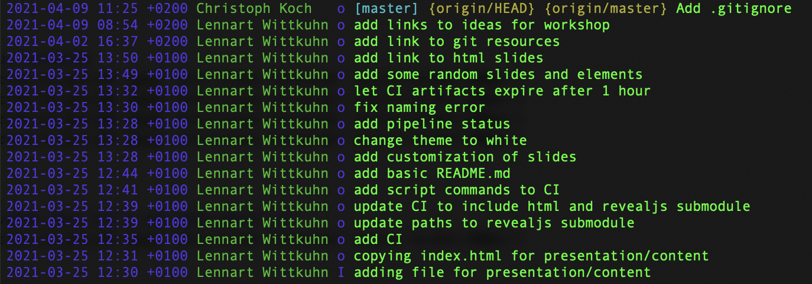

## Introduction to ```git```

---

### Let's ```git``` going

---

#### This is classic Linus Torvalds


---

#### This is recent Linus Torvalds


---

#### This is artwork of Linus Torvalds


---

#### This is also Linus Torvalds (but let's not talk about it)


---

#### The Story of ```git```
**"I'm an egoistical bastard, and I name all my projects after myself. First 'Linux', now 'Git'"**
- Developed after licensing blocked free usage of BitKeeper since company broke down (2005)
- First version after a couple of days
"git can mean anything, depending on your mood"

---

#### ```git``` is a DVCS

```bash
nrcd-osx-003855:git-workshop koch$ tig
```



- "Distributed **Version Control** System"
- Taking "snapshots" of your project at any time point
     - Go back to any snapshot and its current state of the project

- A folder structure that ```git``` keeps track of is called a **"repository"**

---

#### ```git``` is a DVCS

```bash
nrcd-osx-003855:git-workshop koch$ tig
```


- Can work as a "time machine"
  - Restore projects at specific snapshots
  - Compare different snapshots
  
"Oh no, my decoding results completely changed compared to last time I checked! What did I change since then?"

---

#### The power of the ```remote```

- "**Distributed** Version Control System"

<!-- "Cloud-local" picture -->

- Instead of on your ```local``` machine these repositories can also be set up on a ```remote``` location!
     - GitLab, GitHub, BitBucket
     
- The pros:
     - Backup save form all harm (doesn't matter what happens to your machine)
     - **Collaboration**
     - Sharing

---

#### Today we will...

- ...give an overview of the **basics commands**
    - ```git status```, ```git add```, ```git commit```, ```git push```, ```git pull```, ```git merge```, ```git checkout```
- ...introduce a **workflow guideline** to avoid problems
     - Using branches and merging
- ...learn about **collaborative work** using GitLab
    - in lab use-case example
    - Dealing with merge conflicts
    - Git issues
- ...cover project management using GitLab
- ...end with some advanced usage of ```git```

---

### 

---

