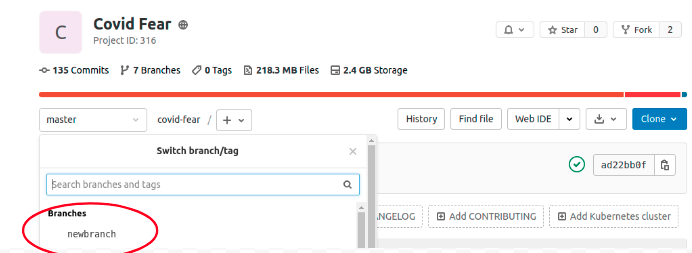
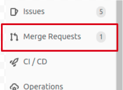
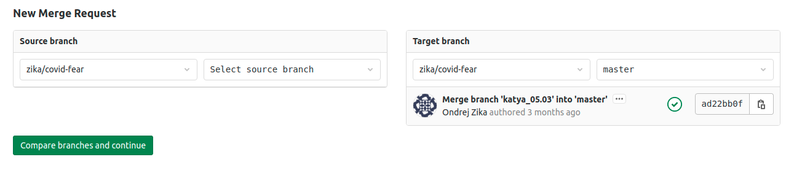
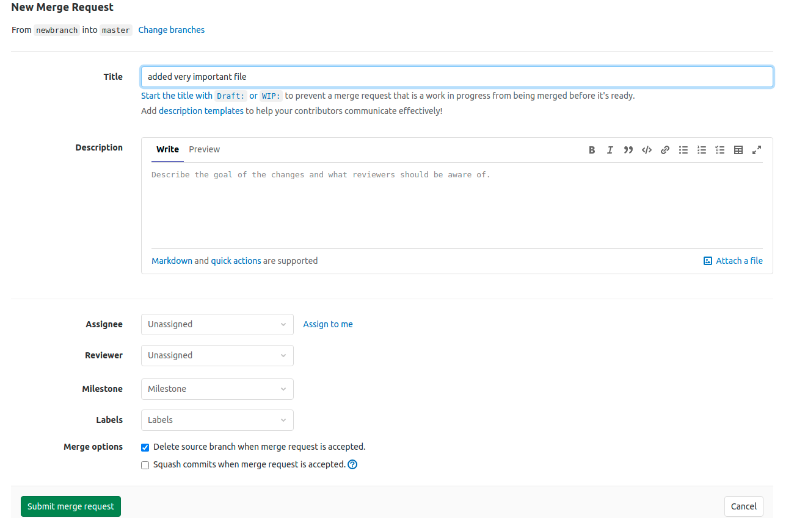
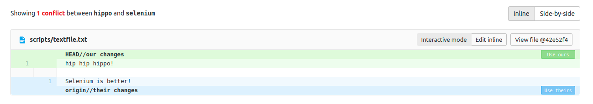
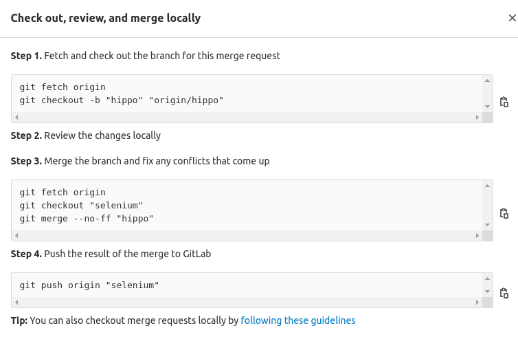

### Introduction
#### What was covered before
- working with git on your own
- branching, staging, commiting, pulling, pushing

#### What will we learn in this section
1. how to work on the same code at the same time as others
2. what's the correct workflow
3. how to spot and solve merge conflicts using gitlab and command line
4. how to time travel (get a version of one file from long ago)

---
### Motivation 
- need to work on the same code at the same time
- contributing to other projects, incl. packages on github

---
### Project roles
- `maintainer` person responsible for merge requests (usually project leader)
- `developer` person contributing but not responsible for the repo, can't merge on remote (usually contributors)
- it's usually good idea to have dedicated person (usually `maintainer`) to manage all merging on remote

--

### Daily routine
1. check (that you are in the right place)
2. pull (get the most recent version of the code from the remote)
3. branch (branch off, don't work on master/main)
4. work (work, stage and commit as you go)
5. push (push to remote)
6. merge (create a merge request)

---
#### 1. check

```bash
cd /path/to/repository/
```

check if you are on `master` branch 

```bash
git branch
```

**output:**

```bash
  master
* ondrej
```
if not on master:

```bash
git checkout master
```
then pull from the remote

```bash
git pull
```

---
#### 1. check: troubleshooting

**problem** can't merge becuse content on your current branch not commited:
```bash
error: Your local changes to the following files would be overwritten by checkout:
	content/02_collaboration_using_git.Rmd
	content/02_collaboration_using_git.html
Please commit your changes or stash them before you switch branches.
Aborting
```
**solution** stage and commit changes

```bash
git add new_file.txt //or add everything new using git add -A
git commit -m "added new_file.txt"
```

**optional** check what the differences are exactly between your current location and `master`
```bash
git diff master
```

---
#### 2. pull

- most recent version of the code should be on the remote (on the master branch in most cases)
- if so, simply pull 
```bash
git pull
```
---
#### 2. pull troubleshooting
a. if there is a difference *but not merge conflict* between your local `master` and the remote `master`
- git will automatically merge them, but it will ask you to give a name to the commit
- this will open default terminal text editor (`emacs`, `vim`, `nano`)
- on tardis, it's `vim`, you need to press `i` to insert the commit name, then `Esc` followed by a `:wq` [save (w) and exit (q)]

---
#### 2. pull troubleshooting
b. if there *is a merge conflict* between your local `master` and the remote `master`
```bash
git pull 
```
```bash
Auto-merging content/02_collaboration_using_git.Rmd
CONFLICT (content): Merge conflict in content/02_collaboration_using_git.Rmd
Automatic merge failed; fix conflicts and then commit the result.
```
open the file that contains conflicts (using any text editor) and find a weird-looking section:
```bash
<<<<<<< HEAD
text from remote
======= 
my local new much better text
>>>>>>> 3989e0b850520f2ce7853bd73009449114f13436

```
in short the `<<<` show the start of the conflict, the `>>>>>> 39...` (commit ID) show the end, and in the middle there is `====`
one simply needs to choose which version they want to keep by deleting *all* unwanted text, in our case I want to just keep this:
```bash
my local new much better text
```

---

#### 3. branch

- since the *most up-to-date work* is on `main` create a new branch and move there

```bash
git branch mybranch
git checkout mybranch 

```

- the same can be achieved using single command

```bash
git checkout -b mybranch

```

- check where you are 

```bash
git branch

```

---

#### 4. work & 5. push

- simply go about your business as usual
- committing meaningful steps helps but it's not necessary 
- at the end of the work block, stage and commit your changes

```bash
# add specific file
git add file_you_worked_on.neurocode 
# add all new changes
git add .

# commit
git commit -m "removed all outliers > effect size now massive!" 

git push 

```

---

#### 5. first push from your branch 

- the current branch `mybranch` needs to be associated with a remote branch, to do that:

```bash
git push --set-upstream <remote> <branch>
# example
git push --set-upstream origin mybranch

```

- this creates a branch called `origin/mybranch` (not that there are now **2** `mybranch` branches, one local and one on the remote)


*Note:* It is possible to have a branch associated with more than one remote :) 

---

#### 6. merge

- once you push, you can see the new content via the gitlab interface, you just need to witch to the correct branch: 



- to merge the new code to the `main` branch, the `requester` **creates a merge request**, to do this click `merge requests` in the left menu 



---

#### 6. merge

- "new merge request" 
- select source and target branches



---

#### 6. merge

- document the request and review the changes below



---

#### 6. merge

- when you hit "submit" gitlab automatically checks if the source branch is compatible with the target branch 


- if all is well and there are no conflicts gitlab will indicate that the branches can be merged 


- it should be the `maintainer` or an `assigned person` that does the merging (in companies every team has a dedicated person, sometimes even full time employee to do this)
- if the `maintainer` is happy, they can perform the merge
- if not happy, they can request changes vie the gitlab interface (see demo) 

*Note* if you want to make changes to existing merge request there is no need to create a new merge request, just `push` and it will get automatically updated 


---


#### Common use case 1: Two people working on the same file

- usually, contributions from different authors are not in conflict, but what if they are? 
- I created 2 local branches (branch `selenium` and branch `hippo`) and edited the same file separately, so there is a conflict, and I pushed them both

- to merge them create a merge request of `hippo` into `selenium`
- now gitlab will detect conflict and not allow merge until it's resolved: 


- clicking "resolve conflicts" will show the difference and let you choose one or manually create a combination (see demo)



---

#### Common use case: Two people working on the same file

- you can also "merge locally", gitlab will actually give you neat guidelines on how to do it: 




---

#### Less common use case: Time travel

- let's say that you want a piece of code that you committed long time ago but have deleted since
**Solution:** Checkout *one* file from a *past commit*
1. find the commit `<commit-hash>`
2. locate the file `<file>`

```bash

git checkout `<commit-hash>` `<file>`

#example
git checkout 57e307d4356a01bc6b5d3ed0aed5b678af25ffdc ../docs/documentation/dates.md


```
3. this will make `dates.md` a file in the current branch that you can edit, commit and push as usual

---


#### A few tips

- be state-aware (always keep in mind *where* you are working and what actions does git perform, most errors will make sense)
- plain text files over formatted files (`csv` over `xlsx`; `.py` over `.ipynb`, see [example](https://git.mpib-berlin.mpg.de/zika/unc_x2/-/blob/master/pb1/analysis/color_palettes_seaborn.ipynb))
- mixing manual copying and using git features will "start WW3", at least in your mind


saa