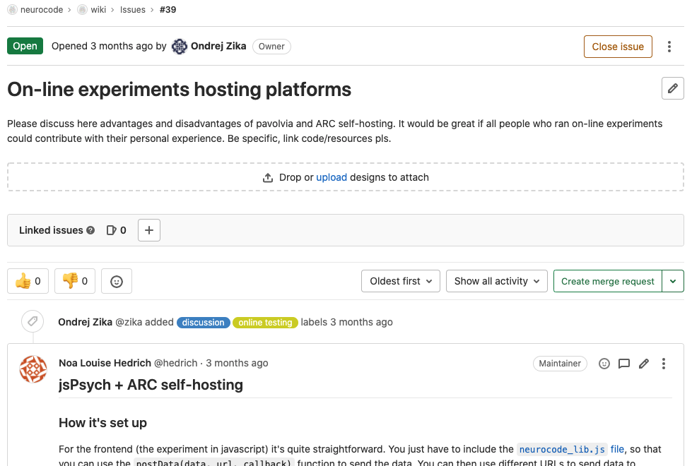
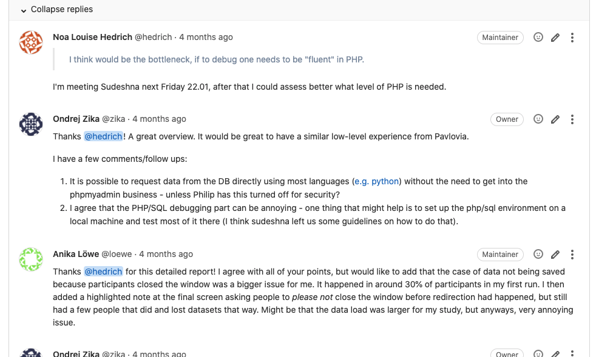
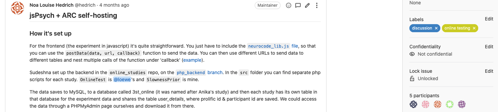
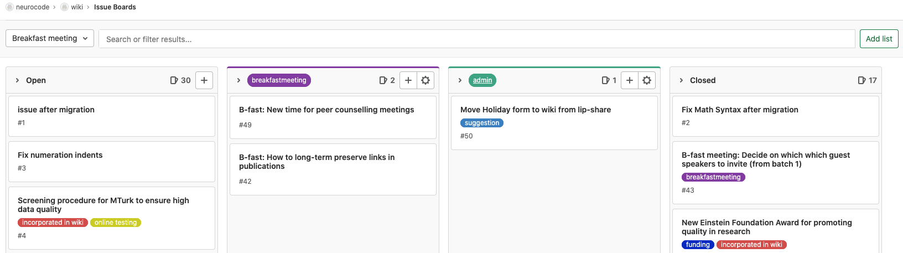
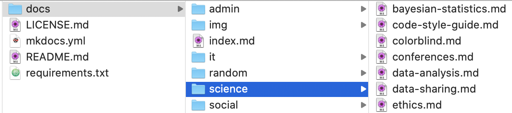
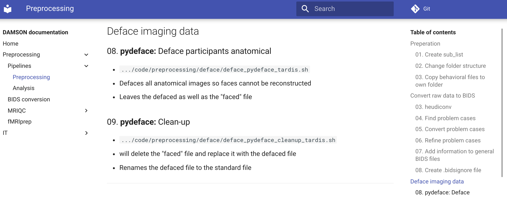

class: middle

## Using `git` and Gitlab for project management

---

### Content

`1.` Using `git` issues

`2.` Documentation and wiki

`3.` Permissions and roles

---

### `1.` Using `git` issues

**What is an issue?**
- "Note" concerning a repository
- Has **two states:**
     - `1.` `Open` (Still relevant, under discussion)
     - `2.` `Closed` (Fixed, not relevant anymore, part of history)
- Integrated discussion feature

--

.center[

]

---

### `1.` Using `git` issues

**Why are issues useful?** (scientific perspective)
- **To-Do**/list of tasks/problems
  - e.g. tracking and addressing comments of reviewers
- Interactive and documented **discussions** of solution/topic
- Even when closed will still be part of the **history**
  - Does never change location/easy to find again
> *Wait, I had this problem, too! Let me show you my issue on this*

--

.center[

]

---

### `1.` Using `git` issues

**How to manage issues?**
- When opening:
  - Describe problem understandably
  - Use labels
  - Tag relevant people
- When discussing:
  - Use threads and the reply function
- Close if fixed

--

.center[

]

---

### `1.` Using `git` issues

**GitLab issue boards**

- Project management interface (similar to e.g. Trello)

.center[

]

---

### `2.` Documentation and/or Wiki

**Documentation is important**
- Coming back to the project after some time
- Other people looking into your code/project

***

--

**Necessary documents to maintain**

- `README.md`
     - What is the project about? Who is involved?
     - All information you feel is important to understand the project

--

**Useful documents to maintain**
- **Pipeline**
     - Preprocessing (Step-by-step from raw data)
     - Analysis (Different analyses, step-by-step)
- **Overview of files**
     - Explanation what each file/script does/is used for
     - Files which are tracked in the repo and are **not created along the way**

---

### `2.` Documentation and/or Wiki

**Simple documentation structure**
- `docs` folder in repo root
     - As many subfolders as you like for your documentation
     - `img` folder to hold images
- Collection of `.md` files

.center[

]

***

--

**Not far away from online Wiki**
- (if you want!) following this structure allows an easy wiki set up
- Documentation engine (e.g. **`make-the-docs/mkdocs`**)
- Continuous integration (**CI**)

---

### `2.` Documentation and/or Wiki

.center[

]

---

### [`3.` Permissions and roles (on GitLab)](https://about.gitlab.com/handbook/product/gitlab-the-product/#permissions-in-gitlab)

- Each `remote` repository can have multiple members
- but not all members should be able to do everything

***

**Roles** (with increasing permissions):

`1.` **Guest** and **Reporter:**
- Read-only, creating/commenting on issues

`2.` **Developer**
- Can contribute to code/branches
- Not allowed to push to `main`

`3.` **Maintainer:**
- 'super-developers'
- can also push to `main`

`4.` **Owner:**
- Group and project admin, no limits

---

### [`3.` Permissions and roles (on GitLab)](https://about.gitlab.com/handbook/product/gitlab-the-product/#permissions-in-gitlab)

- Each `remote` repository can have multiple members
- but not all members should be able to do everything

***

- Keep control over `main` branch of your own project to avoid conflicts
- Using roles makes most sense when GitLab/`git` features are used
     - Issues, branches, merging, ...
     
.center[

]

