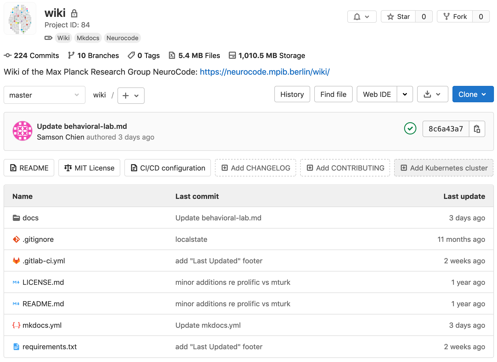

```{r, echo=FALSE}
library(xaringan)
# xaringan::inf_mr()
# http://jenrichmond.rbind.io/post/infinite-moon-reader/
```

```{css, echo=FALSE}
@media print {
  .has-continuation {
    display: block !important;
  }
}
```

```{r setup, include=FALSE}
options(htmltools.dir.version = FALSE)
library(knitr)
opts_chunk$set(
  fig.align="center", #fig.width=6, fig.height=4.5, 
  # out.width="748px", #out.length="520.75px",
  dpi = 300, #fig.path='Figs/',
  cache = T#, echo=F, warning=F, message=F
  )
```

---

# The MPRG NeuroCode wiki

The wiki is available<sup>1</sup> at https://git.mpib-berlin.mpg.de/neurocode/wiki

```{r, echo=FALSE, out.width="65%", fig.cap="<sup>Screenshot of the MPRG NeuroCode wiki (taken 2021-04-16)</sup>"}

```

<sup><sup>1</sup> for logged-in MPIB user who have been added to the GitLab `neurocode` user group</sup>

---

### Clone the wiki

Use `git clone` to clone the wiki repo to your system:

```{bash, eval=FALSE}
$ git clone git@git.mpib-berlin.mpg.de:neurocode/wiki.git
Cloning into 'wiki'...
remote: Enumerating objects: 129, done.
remote: Counting objects: 100% (129/129), done.
remote: Compressing objects: 100% (67/67), done.
remote: Total 1340 (delta 83), reused 95 (delta 62), pack-reused 1211
Receiving objects: 100% (1340/1340), 4.91 MiB | 232.00 KiB/s, done.
Resolving deltas: 100% (886/886), done.
```

---

### What is the wiki made of:

```{bash, eval=FALSE}
$ cd wiki && tree -L 1
.
├── LICENSE.md
├── README.md
├── docs
├── mkdocs.yml
└── requirements.txt
```

---

# Interlude: mkdocs

[https://www.mkdocs.org/](https://www.mkdocs.org/)

> MkDocs is a fast, simple and downright gorgeous static site generator that's geared towards building project documentation.
> **Documentation source files** are written in **Markdown**, and configured with a single **YAML configuration file**.

```{bash, eval=FALSE}
$ tree -L 1
.
├── LICENSE.md
├── README.md
├── docs
├── mkdocs.yml
└── requirements.txt
```

---

see the [usage guide](https://neurocode.mpib.berlin/wiki/admin/usage/)

```{bash, eval=FALSE}
$ cd docs && ls && cat index.md
admin    img      index.md it       random   science  social
```

```{console, eval=FALSE}
# Welcome to the wiki of the MPRG NeuroCode!


## New to the lab?

Check our [onboarding guide](admin/onboarding.md) to set up everything you need in 10 minutes!

## How the Wiki works

Check our [guide on how to use the wiki](admin/how-to-use-the-wiki)
```

This 👆 is [Markdown syntax](https://www.markdownguide.org/basic-syntax/) (and a tiny bit of HTML to include an image)
- You (can) use Markdown syntax in Mattermost posts (see [here](https://docs.mattermost.com/help/messaging/formatting-text.html))
- Markdown syntax is optional!

---

# Edit an existing wiki entry

Open the file in your favorite text editor (e.g., Atom) or directly in the terminal:

- Use `vim index.md` to open the file in the `vim` text editor
- Press `i` and enter your changes
- Save with `Esc` + `:wq` (write + quit) + `Enter`

```{console, eval=FALSE}
# Welcome to the wiki of the MPRG NeuroCode!


## New to the lab?

{{Welcome to the best lab 4 ever!}}

Check our [onboarding guide](admin/onboarding.md) to set up everything you need in 10 minutes!

## How the Wiki works

Check our [guide on how to use the wiki](admin/how-to-use-the-wiki)
```

---

# Show changes using git

```{console, eval=FALSE}
$ git diff
diff --git a/docs/index.md b/docs/index.md
index 26015bb..4715b12 100755
--- a/docs/index.md
+++ b/docs/index.md
@@ -4,6 +4,8 @@
 
 ## New to the lab?
 
+Welcome to the best lab 4 ever!
+
```

```{bash, eval=FALSE}
$ git status
On branch master
Your branch is up to date with 'origin/master'.

Changes not staged for commit:
  (use "git add <file>..." to update what will be committed)
  (use "git checkout -- <file>..." to discard changes in working directory)

	modified:   index.md

no changes added to commit (use "git add" and/or "git commit -a")
```

---

# Add and commit the changes

#### aka. daily git 🍞 and butter

We add the changes using `git add`:

```{bash, eval=FALSE}
$ git add index.md
```

We commit the changes using `git commit`:

```{bash, eval=FALSE}
$ git commit -m "add welcoming greeting with self-confidence in index.md"
[master 24ed418] add welcoming greeting with self-confidence in index.md
 1 file changed, 2 insertions(+)
```

We push the changes using `git push`:

```{bash, eval=FALSE}
git push -u origin master
```

---

# Add a new file / page

We created a new page in the `admin` folder (e.g., using `vim new_page.md`)

```{bash, eval=FALSE}
$ git status
On branch master
Your branch is ahead of 'origin/master' by 1 commit.
  (use "git push" to publish your local commits)

Untracked files:
  (use "git add <file>..." to include in what will be committed)

	new_page.md

nothing added to commit but untracked files present (use "git add" to track)
```

> "Ok, got it, `git add`, `git commit`, `git push`, right?"

**Halt!** 👮🚔🚨

Remember the `mkdocs` documentation:

>  Documentation source files are written in Markdown, and **configured** with a single **YAML configuration file**.

---

# Add new page to mkdocs.yml

> Project settings are always configured by using a YAML configuration file in the project directory named `mkdocs.yml`.
> As a minimum this configuration file must contain the `site_name` setting.
> All other settings are optional.

```{console, eval=FALSE}
$ sed -n 1,6p mkdocs.yml
site_name: NeuroCode Wiki # the name of the rendered wiki page
repo_url: https://git.mpib-berlin.mpg.de/neurocode/wiki # the url of the wiki repo
edit_uri: edit/master/docs/ # enable edit links in the rendered wiki page
site_url: https://neurocode.mpib.berlin/wiki # url of the rendered wiki page
docs_dir: docs # directory of the documentation files
copyright: 'Copyright &copy; 2021 - Max Planck Research Group NeuroCode' # copyright displayed in the footer
```

- See the [mkdocs docs on "Configuration"](https://www.mkdocs.org/user-guide/configuration/) for details
- You *don't need* to change these files!

---

# Add new page to the navigation

`mkdocs` tells us that `admin/new_page.md` in not yet included in the `nav`:

```{bash, eval=FALSE}
$ mkdocs serve
INFO    -  Building documentation... 
INFO    -  Cleaning site directory 
INFO    -  The following pages exist in the docs directory,
but are not included in the "nav" configuration:
  - admin/new_page.md
```

To add the new `new_page.md` to the wiki, we need to edit the `nav`:

```{console, eval=FALSE}
$ sed -n 7,14p mkdocs.yml
nav:
  - "Home": index.md
  - "New to the lab?": admin/onboarding.md
  - "Usage Guide": admin/usage.md
  - "Admin":
    - "Accounts": admin/accounts.md
    - "Behavioral lab": admin/behavioral-lab.md
    - "Calendars": admin/calendars.md
```

---

# Edit `nav`

We open `mkdocs.yml` in a text editor (e.g., `vim mkdocs.yml`) and add the new page `admin/new_page.md` to the `nav` items.
`git diff mkdocs.yml` can show us the changes:

```{console, eval=FALSE}
$ git diff mkdocs.yml 
diff --git a/mkdocs.yml b/mkdocs.yml
index f338181..85fed55 100755
--- a/mkdocs.yml
+++ b/mkdocs.yml
@@ -10,6 +10,7 @@ nav:
   - "Usage Guide": admin/usage.md
   - "Admin":
     - "Accounts": admin/accounts.md
{{+    - "My cool new page": admin/new_page.md}}
     - "Behavioral lab": admin/behavioral-lab.md
     - "Calendars": admin/calendars.md
     - "Contact": admin/contact.md
```

---

# Review and save all the changes:

```{bash, eval=FALSE}
$ git status
On branch master
Your branch is up to date with 'origin/master'.

Changes not staged for commit:
  (use "git add <file>..." to update what will be committed)
  (use "git checkout -- <file>..." to discard changes in working directory)

	modified:   mkdocs.yml

Untracked files:
  (use "git add <file>..." to include in what will be committed)

	docs/admin/new_page.md

no changes added to commit (use "git add" and/or "git commit -a")
```

Finish with
- `git add .`
- `git commit -m "add new cool admin page"`
- `git push -u origin master`

🎉


