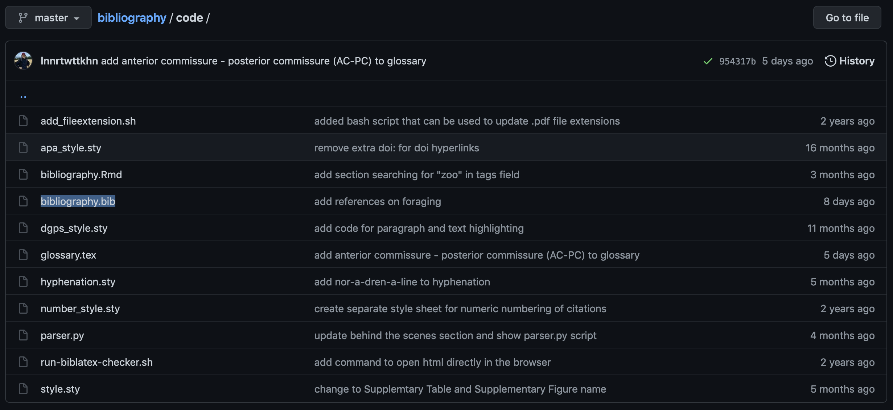
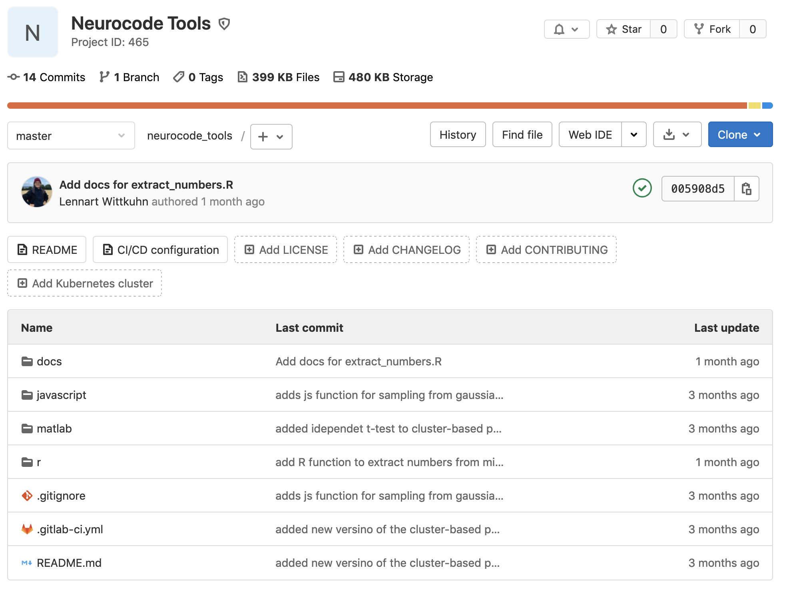

```{r, echo=FALSE}
library(xaringan)
# xaringan::inf_mr()
# http://jenrichmond.rbind.io/post/infinite-moon-reader/
```

```{css, echo=FALSE}
@media print {
  .has-continuation {
    display: block !important;
  }
}
```

```{r setup, include=FALSE}
options(htmltools.dir.version = FALSE)
library(knitr)
opts_chunk$set(
  fig.align="center", #fig.width=6, fig.height=4.5, 
  # out.width="748px", #out.length="520.75px",
  dpi = 300, #fig.path='Figs/',
  cache = T#, echo=F, warning=F, message=F
  )
```

# Table of contents

1. [Submodules](#submodules)

---

# Submodules


#### What is it?

Submodules allow you to keep a Git repository as a subdirectory of another Git repository

--

#### Advantages

- Avoiding redundancy / duplication
- Allowing reusability
- Independent commit history
- Modularity

--

#### Typical situations where submodules can help:

- "*I want to reuse code from another repo.*" e.g., use the [NeuroCode Tools](https://git.mpib-berlin.mpg.de/neurocode/neurocode_tools/) in your project
- "*I copied code from a second project but then I changed it and now I need to update it in the second project as well*"
- "*Thanks for sending me the code for your pre-processing pipeline. I fixed some bugs that you should fix in your code version as well. Here is the updated file.*"
- "*Which version of the input data did we use in this analysis?*"

---

# Example 1: A modular bibliography.bib file

```{r, echo=FALSE, out.width="80%", fig.cap='<a href="https://github.com/lnnrtwttkhn/bibliography" target="_blank">https://github.com/lnnrtwttkhn/bibliography</a>'}

```

--

Add the bibliography repo as a Git submodule, then in your LaTeX manuscript:
```latex
\bibliography{bibliography/code/bibliography.bib}
```

---

# Example 2: Reusable code libraries

```{r, echo=FALSE, out.width="60%", fig.cap='<a href="https://git.mpib-berlin.mpg.de/neurocode/neurocode_tools/" target="_blank">https://git.mpib-berlin.mpg.de/neurocode/neurocode_tools/</a>'}

```

--

```{r, eval=FALSE}
source('/gdrive/workbench/R/tools/misc/gen_functions.R')
```

🙂

---

# Git submodules: Adding a submodule

Add an existing Git repository as a submodule:

```bash
$ git submodule add https://git.mpib-berlin.mpg.de/neurocode/neurocode_tools.git
```

--

The `neurocode_tools` Git repo will be cloned into the `neurocode_tools` subdirectory:

```bash
Cloning into '/Users/wittkuhn/neurocode/git-workshop-examples/neurocode_tools'...
remote: Enumerating objects: 97, done.
remote: Counting objects: 100% (97/97), done.
remote: Compressing objects: 100% (62/62), done.
remote: Total 97 (delta 27), reused 70 (delta 21), pack-reused 0
Unpacking objects: 100% (97/97), done.
```

--

By default, submodules will add the subproject into a directory with the same name as the repository, in this case `neurocode_tools`.
You can add a different path at the end of the command if you want the submodule to be cloned into a different path or directory name:

```bash
git submodule add https://git.mpib-berlin.mpg.de/neurocode/neurocode_tools.git \
awesome_tools
```

---

# Git Submodules: What happened?

Let's run `git status` to see what happened to our repo:

```{bash, eval=FALSE}
$ git status
On branch master
Your branch is up to date with 'origin/master'.

Changes to be committed:
  (use "git reset HEAD <file>..." to unstage)

	new file:   .gitmodules
	new file:   neurocode_tools
```

--

There are two new files:

1. `.gitmodules`
1. `neurocode_tools`

Let's check out what those files are!

---

## Git submodules: What is in `.gitmodules`?

`.gitmodules` stores the mapping between the submodule's URL and the local subdirectory you've pulled it into

```{bash, eval=FALSE}
$ cat .gitmodules
[submodule "neurocode_tools"]
	path = neurocode_tools
	url = https://git.mpib-berlin.mpg.de/neurocode/neurocode_tools
```

--

- Multiple submodules will lead to multiple entries in `.gitmodules`
- Committing `.gitmodules` to your repo is important, so that collaborators know where to get the submodule from
- Make sure that the URL in `.gitmodules` is accessible by others (use `https`)
- To overwrite the URL use `git config submodule.<submodule_name>.url <new_url>`

---

## Git submodules: What is in `neurocode_tools`?

```{bash, eval=FALSE}
$ git diff --cached neurocode_tools
diff --git a/neurocode_tools b/neurocode_tools
new file mode 160000
index 0000000..383a616
--- /dev/null
+++ b/neurocode_tools
@@ -0,0 +1 @@
+Subproject commit 383a616af6d972313c6cf5e3ab743aecc5fed6cd
```

Cryptic! 🤨

--

Although `neurocode_tools` is a subdirectory in your repo, Git doesn't track its contents (when you are not in that directory) but sees it as as submodule.

Instead, Git **references one particular commit** of the submodule repository:

`Subproject commit 383a616af6d972313c6cf5e3ab743aecc5fed6cd`.

---

Let's add and commit the submodule (using combined `add` and `commit` with `-am`) ...

```{bash, eval=FALSE}
{{$ git commit -am "Add neurocode_tools module"}}
[master df9a330] Add neurocode_tools module
 2 files changed, 4 insertions(+)
 create mode 100644 .gitmodules
 create mode 160000 neurocode_tools
```

... and push! 🚀

```{bash, eval=FALSE}
{{$ git push origin master}}
Enumerating objects: 4, done.
Counting objects: 100% (4/4), done.
Delta compression using up to 4 threads
Compressing objects: 100% (3/3), done.
Writing objects: 100% (3/3), 426 bytes | 426.00 KiB/s, done.
Total 3 (delta 0), reused 0 (delta 0)
To git.mpib-berlin.mpg.de:neurocode/git-workshop-examples.git
   1fbe5b6..df9a330  master -> master
```

---

# And now?

#### Now you can just access and use files in the submodule

```{bash, eval=FALSE}
{{$ ls}}
README.md       neurocode_tools
```

We can `cd` into the `neurocode_tools` submodule and access its files:

```{bash, eval=FALSE}
{{$ cd neurocode_tools && ls}}
README.md  docs       javascript matlab     r
```

Cool! 🤩

---

# Cloning repos with submodules

We clone a repo with a submodule:

```{bash, eval=FALSE}
$ git clone https://git.mpib-berlin.mpg.de/neurocode/git-workshop-examples.git
Cloning into 'git-workshop-examples'...
remote: Enumerating objects: 6, done.
remote: Counting objects: 100% (6/6), done.
remote: Compressing objects: 100% (5/5), done.
remote: Total 6 (delta 0), reused 0 (delta 0), pack-reused 0
Unpacking objects: 100% (6/6), done.
```

--

We `cd` into the cloned repo and list its contents using `ls`:

```{bash, eval=FALSE}
$ cd git-workshop-examples && ls
README.md       neurocode_tools
```

--

```{bash, eval=FALSE}
$ cd neurocode_tools && ls
$ 
```

It's empty?! 😳 Why?

---

# Initializing a submodule after cloning

We first need to run `git submodule init` to initialize the local configuration file: 

```{bash, eval=FALSE}
$ git submodule init
Submodule 'neurocode_tools' (https://git.mpib-berlin.mpg.de/neurocode/neurocode_tools) registered for path 'neurocode_tools'
```

--

We then run `git submodule update` to fetch all data of the submodule and check out the appropriate commit:

```{bash, eval=FALSE}
$ git submodule update
Cloning into 'neurocode_tools'...
warning: redirecting to https://git.mpib-berlin.mpg.de/neurocode/neurocode_tools.git/
Submodule path 'neurocode_tools': checked out '383a616af6d972313c6cf5e3ab743aecc5fed6cd'
```

Now the `neurocode_tools` subdirectory is in the *exact* state of the commit 🎉

---

> "The lazy version, please!"

```{bash, eval=FALSE}
$ git clone https://git.mpib-berlin.mpg.de/neurocode/git-workshop-examples.git \
--recurse-submodules
Cloning into 'git-workshop-examples'...
remote: Enumerating objects: 6, done.
remote: Counting objects: 100% (6/6), done.
remote: Compressing objects: 100% (5/5), done.
remote: Total 6 (delta 0), reused 0 (delta 0), pack-reused 0
Unpacking objects: 100% (6/6), done.
Submodule 'neurocode_tools' (https://git.mpib-berlin.mpg.de/neurocode/neurocode_tools) registered for path 'neurocode_tools'
Cloning into 'neurocode_tools'...
warning: redirecting to https://git.mpib-berlin.mpg.de/neurocode/neurocode_tools.git/
remote: Enumerating objects: 97, done.        
remote: Counting objects: 100% (97/97), done.        
remote: Compressing objects: 100% (62/62), done.        
remote: Total 97 (delta 27), reused 70 (delta 21), pack-reused 0        
Submodule path 'neurocode_tools': checked out '383a616af6d972313c6cf5e3ab743aecc5fed6cd'
```

---

> "Dammit, I forgot `--recurse-submodules`!"

Combine `git submodule init` and `git submodule update` to `git submodule update --init`

Or foolproof `git submodule update --init --recursive`

---

# Updating submodules

The basic way of working with submodules is to **simply "consume" a subproject**, only update the submodule from time to time (i.e., after updating the submodule repo separately), but never changing directly inside the submodule.

We use `git fetch` and ` git merge origin/master` the upstream branch to update the local code (`cd` into `neurocode_tools` first):

```{bash, eval=FALSE}
{{$ git fetch}}
remote: Enumerating objects: 9, done.
remote: Counting objects: 100% (9/9), done.
remote: Compressing objects: 100% (5/5), done.
remote: Total 6 (delta 3), reused 0 (delta 0), pack-reused 0
Unpacking objects: 100% (6/6), done.
From https://git.mpib-berlin.mpg.de/neurocode/neurocode_tools
   383a616..005908d  master     -> origin/master
```

--

```{bash, eval=FALSE}
{{$ git merge origin/master}}
Updating 383a616..005908d
Fast-forward
 docs/_sidebar.md         | 1 +
 docs/r/extract_number.md | 3 +++
 2 files changed, 4 insertions(+)
 create mode 100644 docs/r/extract_number.md
```

---

We `cd ..` back into our main repo and check out what has changed:

```{bash, eval=FALSE}
$ git diff --submodule
Submodule neurocode_tools 383a616..005908d:
  > Add docs for extract_numbers.R
```

--

> "The lazy version, please!"

If you don't to manually fetch and merge in the subdirectory, you can do:

```{bash, eval=FALSE}
git submodule update --remote neurocode_tools
```

Note: The default settings assume that you want to update `master`.
See the [Git documentation on submodules](https://git-scm.com/book/en/v2/Git-Tools-Submodules) on how to tell Git to use a different branch.

Don't forget to commit the update of the submodule!

---

# Pulling changes with submodules

Most of the time, you use `git pull` to update changes in your repo.

```{bash, eval=FALSE}
$ git pull
remote: Enumerating objects: 3, done.
remote: Counting objects: 100% (3/3), done.
remote: Compressing objects: 100% (2/2), done.
remote: Total 2 (delta 1), reused 0 (delta 0), pack-reused 0
Unpacking objects: 100% (2/2), done.
From https://git.mpib-berlin.mpg.de/neurocode/git-workshop-examples
   df9a330..4fd401c  master     -> origin/master
Updating df9a330..4fd401c
Fast-forward
 neurocode_tools | 2 +-
 1 file changed, 1 insertion(+), 1 deletion(-)
```

`git pull` recursively fetches changes in submodules.
*But* it does not **update** them!

(i.e., it does not update the actual files to the newly pulled version)

---

`git status` shows that the submodule is modified and has "new commits":

```{bash, eval=FALSE}
$ git status
On branch master
Your branch is up to date with 'origin/master'.

Changes not staged for commit:
  (use "git add <file>..." to update what will be committed)
  (use "git checkout -- <file>..." to discard changes in working directory)

	modified:   neurocode_tools (new commits)

no changes added to commit (use "git add" and/or "git commit -a")
```

--

To finalize the update, you need to run `git submodule update`:

```{bash, eval=FALSE}
$ git submodule update --init --recursive
Submodule path 'neurocode_tools': checked out '005908d50638ac01cc1d87068a85236f83d30b12'
```

---

`git status` will tell us that everything is fine:

```{bash, eval=FALSE}
$ git status
On branch master
Your branch is up to date with 'origin/master'.
nothing to commit, working tree clean
```

🎉

---

# Submodules: Further reading

What we did *not* cover here:

- Working on a submodule
- Publishing submodule changes
- Merging submodule changes

For details see the [Git documentation on submodules](https://git-scm.com/book/en/v2/Git-Tools-Submodules).

*Sidenote:* [DataLad](https://www.datalad.org/) uses Git submodules under the hood to allow hierarchical [nesting of datasets](https://handbook.datalad.org/en/latest/basics/101-106-nesting.html).
This allows establishing [data lineage / provenance](https://en.wikipedia.org/wiki/Data_lineage), i.e., unambigously identifying which version of a dataset served as the input to another downstream analysis.


